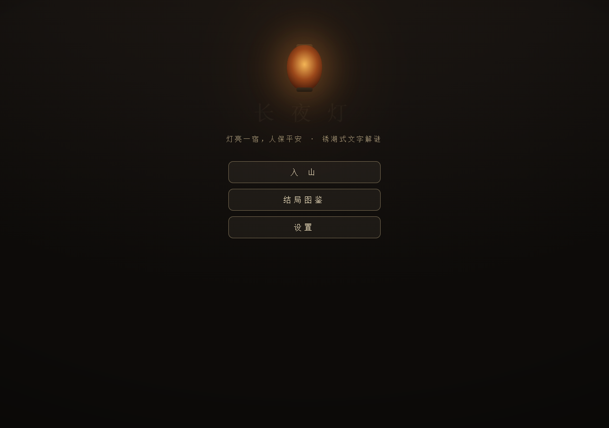

# 长夜灯 · The Long Night Lamp

一款**锈湖式（Rusty Lake）中式志怪文字解谜**网页游戏。
暴雨夜，书生沈砚投宿荒山客栈。山中旧俗：住客要在灯谱上"落名"，灯亮一宿，人保平安——
可这盏灯吃的，是名字背后的记忆。

**单文件、零依赖、离线可玩 —— 直接双击打开 `changye.html` 即可（推荐 Chrome / Edge，手机竖屏可玩）。**



## 玩法特色

- **条件跳转的场景网络**：19 个场景各是一只"谜题盒"，出口由道具、线索、谜题答案、剧情标记把守；
  点锁着的门会弹出机关并暗示你缺什么。所有场景可反复进出，线索永不丢失。
- **文字为核、机关为皮**：每道谜题的关键都是文字线索（匾额笔画、账本欠条、铜镜铭文、藏头诗、
  戏台台规），形是可把玩的机关——转轮锁、算盘还账、九钉向心铜匣、六合陶坛阵、八卦石门、更点灯序。
- **12 粒灯花**：藏在"经不起第二眼"的地方，每粒是一段没被吃掉的记忆。
- **6 个结局 + 3 条隐藏支线**：按终章抉择与收集度分支；
  阿昭的身世、白先生的画稿、乌老板的家书三条线在终章交汇出隐藏结局。
- **笔记与线索合成**：见过的证词自动归档，交叉的线索会自动"印证"出新的推论。
- **分层提示**：每道谜题两级点拨 + 终级答案兜底，永不死卡；localStorage 自动存档。
- **氛围**：暗墨底 × 鎏金文字、打字机文本、Web Audio 合成音效（无素材依赖），全部可开关。

## 不剧透的入门建议

1. 每个场景把「细看」点一遍，线索自动进笔记；
2. 卡住时先回笔记翻旧账，再用 💡 提示（分两级，最后才会给答案）；
3. 一次通关只是开始——结局图鉴会告诉你还有哪里没走到。

## 规模

19 场景 · 20 谜题机关 · 12 道具 · 12 灯花 · 6 结局 · 4 条线索合成推论 · 3 条支线

## 结局与触发条件

> ⚠️ **以下全剧透**，建议通关至少一次再看。

<details>
<summary><b>点开查看全部 6 个结局的达成条件</b></summary>

**进入终章「灯房」的前提**（所有结局的共同门槛）：
持有**记忆之画**（禁房画箱）+ 获得乌老板的**子时邀约**（读地窖日记后，回大堂对质成功），
在祠堂把记忆之画挂上空画架。

| 结局 | 名称 | 触发条件 |
|---|---|---|
| 结局一 | 天亮启程 | 抵达灯房后选「按规矩来——落名，安歇，等天亮」。**无条件可选**，任何进度都保底。 |
| 结局二 | 灯灭（坏） | 持有**灯芯剪** → 选「提起灯芯剪」。坏在剪灯之前没有先给灯一个替代的名字。灯芯剪来源：后院井沿石缝取**当票** → 禁房用当票开画箱。 |
| 结局三 | 灯长明（真结局） | 同时持有**记忆之画 + 阿昭名牌**（地窖六坛，按「子丑合、寅亥合、卯戌合」开启）+ 读过禁房**藏头诗**（灯·吃·人·名），选「以画换名」。 |
| 结局四 | 无名 | 井底石室拓下**生名名条** → 选「把生名名条投进灯里」。下井前提：点亮灯笼 + 麻绳 + 木桶 + 先捞过井（铜镜）。 |
| 隐藏结局·甲 | 灯影中人 | 真结局全部条件 + **十二粒灯花全收集** → 选「摘下那顶斗笠」。灯花位置：山道碑座 / 破庙签筒 / 大堂匾后 / 走廊灯罩顶 / 丙房灯座暗格 / 柜房账本封皮 / 厨房灶王龛后 / 井底石缝 / 禁房画箱底 / 地窖坛后 / 祠堂牌位后 / 荒戏台（点对戏）。 |
| 隐藏结局·乙 | 完璧 | 真结局全部条件 + **三条支线全齐**，选「把三页画稿铺在灯前」：<br>① 白先生线：画稿·甲（记忆之境补「影子」）+ 画稿·乙（静室木匣，输入「昭」）+ 画稿·丙（丙房信匣，输入「山高月小」）；<br>② 阿昭线：厨房四灶按「东→南→西→北」点着得**热粥** → 大堂递给阿九 + 记忆之境更鼓按口诀拼合；<br>③ 乌老板线：未寄家书（静室木匣）+ 记忆之境选「名字早喂回了灯里」。 |

**三条支线速查**：阿昭线 = 热粥 + 递粥 + 更鼓记忆；白先生线 = 三页画稿；乌老板线 = 未寄家书 + 守灯人之名。

</details>

## 目录结构

```
changye.html                 游戏本体（引擎 + 内嵌 JSON 剧情/场景/谜题数据，单文件零依赖）
docs/
  文字解谜游戏-需求文档.md    需求：玩法定义 / 同类调研 / 技术方案 / 决策记录
  剧情与谜题蓝图.md          内容圣经：场景 / 跳转条件 / 谜题-线索映射 / 支线 / 结局
tests/
  changye_verify.mjs         无死档证明：按落名三分支做单调闭包，
                             断言全场景/谜题/热点/出口/结局可达 + 灯花可集齐（7/7）
  changye_test.mjs           真实 UI 流程测试：纯点击/输入走完六个结局（46/46）
  shots/                     视觉巡检截图
```

## 运行测试

```bash
cd tests
npm install          # 仅安装 playwright-core（不下载浏览器，需本机 Chrome）
node changye_verify.mjs   # 无死档可达性证明，7/7
node changye_test.mjs     # 六结局真实 UI 通关，46/46
```

可达性校验原理：游戏内资源只增不耗、门控全是"拥有即过"的单调条件，
因此按"落名"三个剧情分支各做一次贪心闭包，闭包即该分支的可达上限；
任何真实通关路径的收获都是闭包子集，从而严格证明"无死档、全结局可达"。

## 设计文档

- [需求文档](docs/文字解谜游戏-需求文档.md)——玩法定义、锈湖/迷失岛/古镜记调研、技术选型（单文件 + 内嵌 JSON）
- [剧情与谜题蓝图](docs/剧情与谜题蓝图.md)——全部场景的跳转条件表、谜题-线索公平性映射、支线与结局条件

## License

仅供学习交流。
